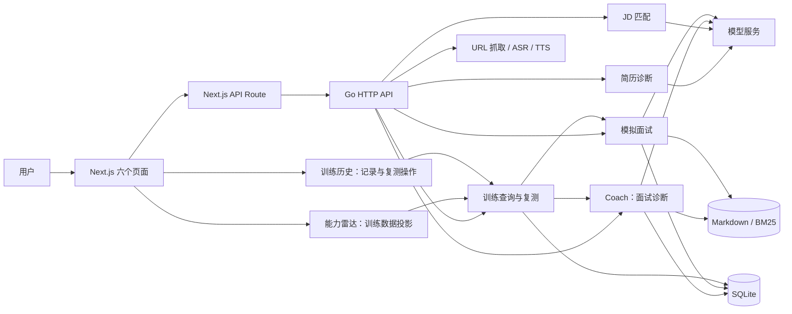
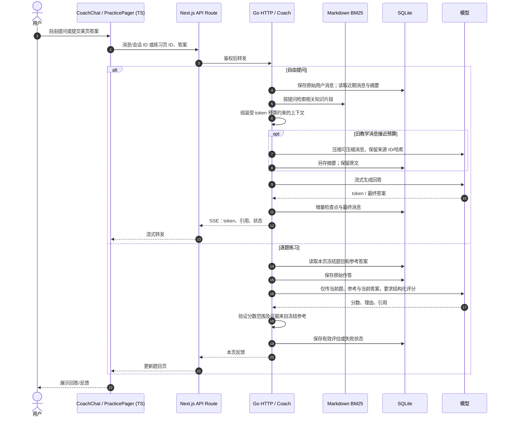
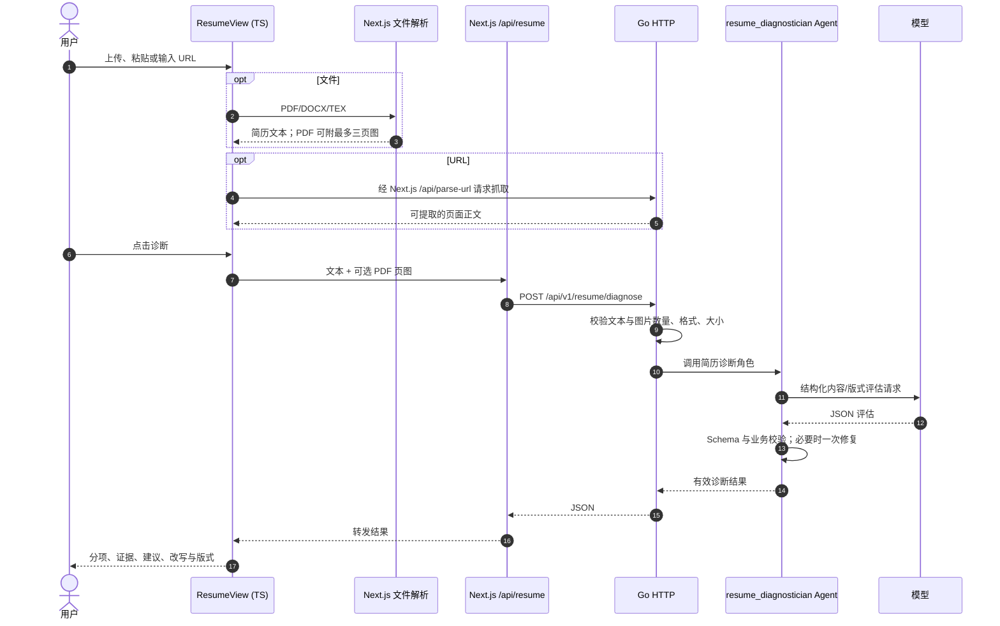
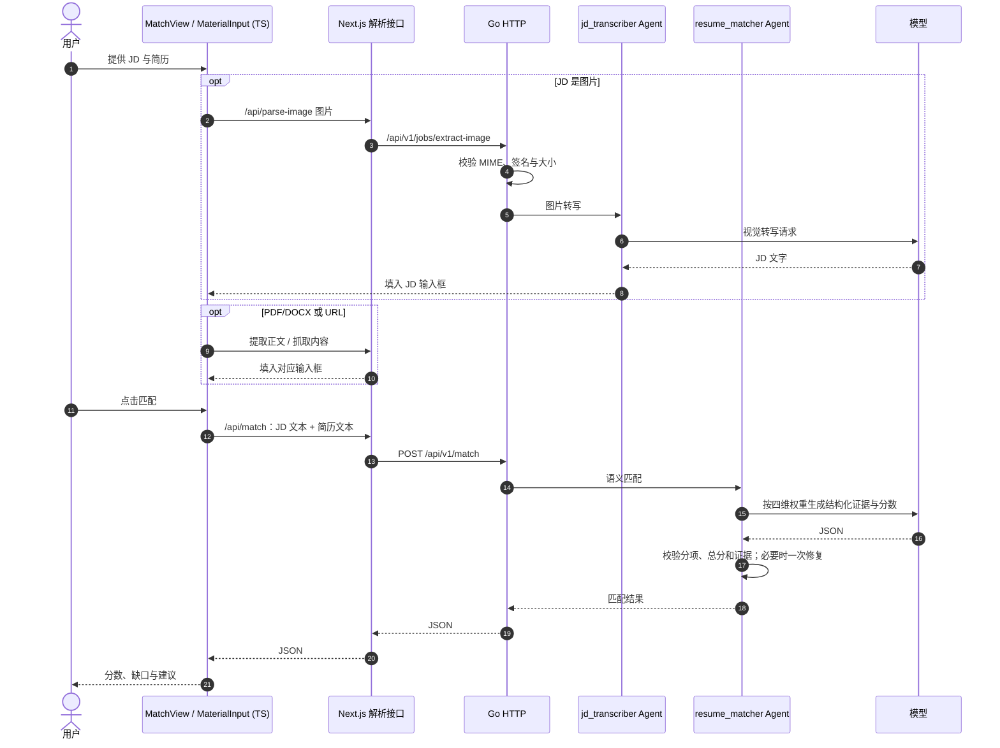
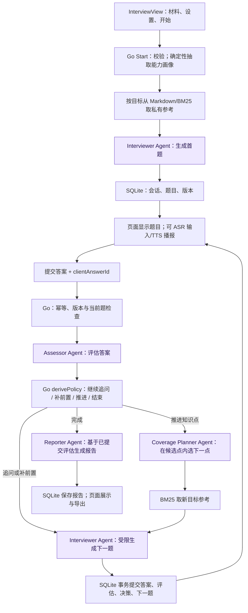
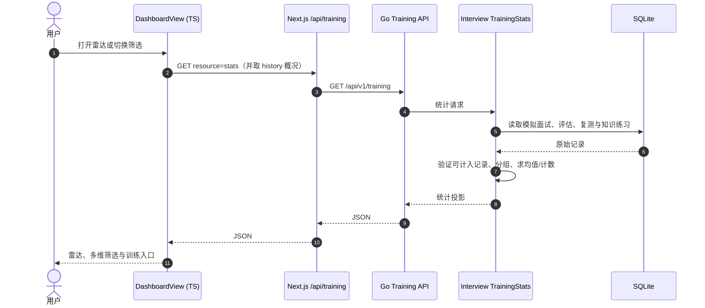
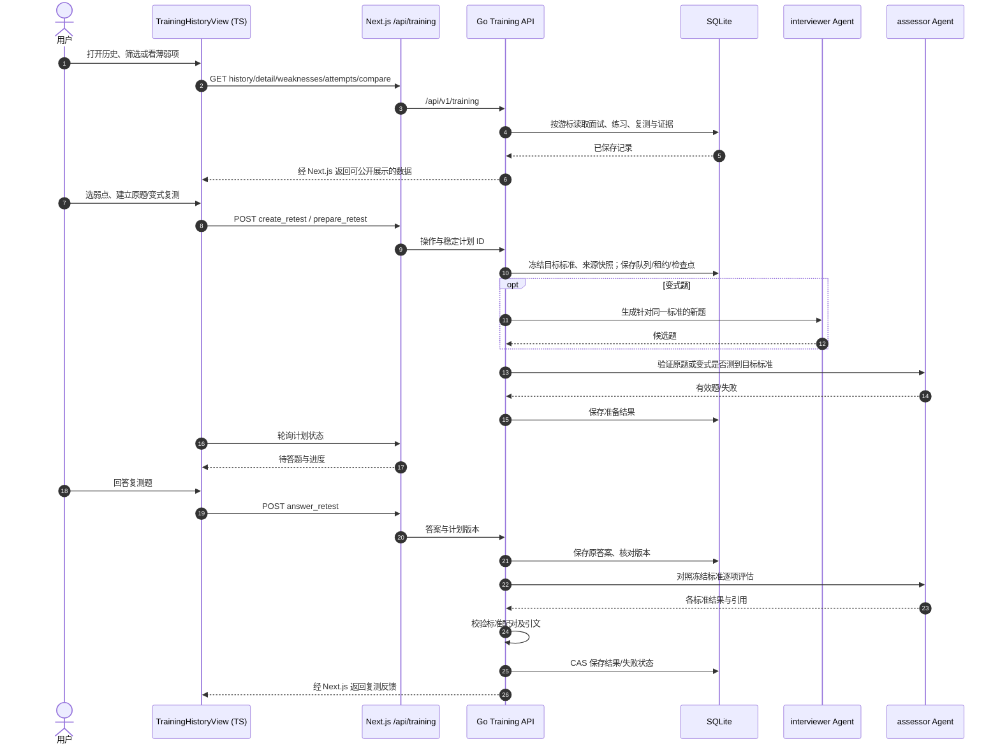

# Aide

**Aide** 意为“助理”。这是一个本地运行的 AI 面试训练与求职材料分析项目，网页提供面试诊断、简历诊断、JD 匹配、模拟面试、能力雷达与训练历史六个模块。浏览器界面由 Next.js/React/TypeScript 实现，业务编排、Agent、知识检索和 SQLite 持久化由 Go 实现。

本仓库根据 [ranxi2001/OfferPilot](https://github.com/ranxi2001/OfferPilot) 的 MIT 许可代码整理；原版权与许可见 [LICENSE](./LICENSE)。仓库名和页面展示名为 Aide，部分 Go 包名、环境变量及旧启动脚本别名保留 `offerpilot`，便于追踪代码与兼容已有接口。

## 安装依赖并启动（Windows）

### 1. 安装系统工具

需要 Git、**Go 1.26 或更高**、**Node.js 24.x**（含 npm）。PowerShell 中可使用 Windows Package Manager：

```powershell
winget install --id Git.Git -e
winget install --id GoLang.Go -e
winget install --id OpenJS.NodeJS.LTS -e --version 24.18.0
```

安装完成后重新打开 PowerShell，确认版本：

```powershell
git --version
go version
node --version
npm --version
```

如果已有其他 Node 版本，确认 `node --version` 显示 `v24.*`；启动脚本会拒绝其他主版本。也可以从 [Go 下载页](https://go.dev/dl/) 和 [Node.js 下载页](https://nodejs.org/en/download) 安装对应版本。

### 2. 克隆仓库并安装项目依赖

```powershell
git clone https://github.com/Miaoxiaobai03/Aide.git
cd Aide
cd backend
go mod download
cd ..\web
npm ci
cd ..
```

`go mod download` 安装 Go 模块；`npm ci` 严格按 `web/package-lock.json` 安装 Next.js、React、PDF/DOCX 解析和页面依赖。**不需要在仓库根目录运行 `npm install`**：根部旧 TypeScript CLI 没有纳入本仓库。运行知识库在 `knowledge/`，SQLite 数据库由首次启动在 `data/` 下创建。

### 3. 配置 DeepSeek API Key

```powershell
Copy-Item .env.example .env
notepad .env
```

将你自己的密钥填入 `.env`：

```dotenv
OPENAI_API_KEY=你的DeepSeek_API_Key
OPENAI_BASE_URL=https://api.deepseek.com
OPENAI_MODEL=deepseek-flash
OPENAI_VISION_MODEL=deepseek-flash
```

变量名是 `OPENAI_API_KEY`，因为 **Go 后端使用 OpenAI 兼容接口**读取 `OPENAI_*`；仅填写 `DEEPSEEK_API_KEY` 对当前 Go 主链路无效。`deepseek-flash` 和 `https://api.deepseek.com` 是 [DeepSeek 官方 API 文档](https://api-docs.deepseek.com/en/) 当前列出的模型和地址；图片输入能力见其 [Vision 文档](https://api-docs.deepseek.com/guides/vision/)。`.env` 已被 Git 忽略，不要提交真实密钥。语音识别与播报需要另外配置 `MIMO_API_KEY`；只使用文本与图片功能时可以留空。

### 4. 用 CMD 启动并检查

```powershell
.\start-aide.cmd
```

双击 `start-aide.cmd` 也可以启动。它检查工具链和密钥、构建 Go API、在后台启动 Go `127.0.0.1:3001` 与 Next.js `localhost:3000`，等待两个健康检查通过后打开浏览器。已安装依赖并填写有效密钥后，无需手动分别启动两台服务。原脚本名 `start-offerpilot.cmd` 作为兼容别名保留。

```powershell
.\start-aide.cmd status
.\start-aide.cmd stop
.\start-aide.cmd restart
```

运行日志与 PID 记录位于被忽略的 `.aide/`；浏览器入口为 [http://localhost:3000](http://localhost:3000)。`status` 检查 Go `/health/ready` 与 Web `/api/health`。脚本只停止它自己记录的进程；若 3000 或 3001 端口被别的程序占用，会提示错误而不会结束其他程序。

> 首次启动必须自行提供有效 DeepSeek Key。安装和本地健康检查不产生模型调用；实际聊天、诊断、匹配、模拟面试会请求模型服务并可能产生费用。新仓库不包含本机数据库、简历、录音或任何真实密钥。

---

## 六个模块的架构与代码

以下解读对应本仓库一起提交的当前 Go + Next.js 代码。图中 Agent 指 Go 侧注册的受约束角色；直接模型调用不经过通用 Agent Loop。箭头表示代码可达路径，不表示每次请求都会触发所有分支。

## 0. 整体边界与共享组件

| 层 | 当前实现 | 职责 |
|---|---|---|
| 页面 | Next.js 16、React 18、TypeScript、Tailwind；[page.tsx](./web/src/app/page.tsx) | 六个侧边栏视图切换、本地交互状态、结果展示 |
| Web 接口 | [web/src/app/api](./web/src/app/api) | 同源请求、PDF/DOCX/TEX 和图片预处理、为 Go 请求附服务端密钥、代理流式响应 |
| Go HTTP | [server.go](./backend/internal/httpapi/server.go) | 校验请求、路由到 Coach、简历、匹配、面试和训练服务 |
| Go 业务 | `coach`、`resumediagnosis`、`jobmatch`、`interview`、`webcrawler`、`harness` | 确定流程、构建模型输入、验证模型输出、记录状态 |
| 检索 | 本地 Markdown 知识索引与 BM25 | 面试知识练习、自由问答、模拟面试题目依据；这里没有向量库链路 |
| 存储 | SQLite `data/offerpilot.db` | 会话、练习、模拟面试、评估、复测、执行事件及历史 |
| 模型与语音 | 模型客户端；配置后可用 ASR/TTS | 文本生成、结构化评估、JD 图片转写、语音输入/播报 |

启动装配见 [main.go](./backend/cmd/offerpilot-api/main.go)。当前共注册 **8 种角色 Agent**：`interviewer`、`assessor`、`coverage_planner`、`reporter`、`web_crawler`、`resume_matcher`、`resume_diagnostician`、`jd_transcriber`。前四个服务模拟面试；`web_crawler` 服务 URL 导入；`resume_matcher` 服务 JD 匹配；`resume_diagnostician` 服务简历诊断；`jd_transcriber` 只处理 JD 图片转文字。Coach 自由聊天及知识练习另有直接模型调用，不能把它们硬归到这八个角色中。

各页面的数据关系：



**一个关键取舍：**“简历诊断”和“JD 匹配”目前是即时分析工具；其结果返回页面，但没有自动写入训练统计、生成模拟面试，也没有自动成为历史记录。“能力雷达”和“训练历史”主要读取模拟面试、知识练习及复测的已存数据，不能理解为前两个即时分析模块的汇总页。

### 共同的材料输入链路

模拟面试与 JD 匹配页使用的 [MaterialInput.tsx](./web/src/components/MaterialInput.tsx) 支持粘贴、上传和 URL。TXT/Markdown 可在浏览器直接读取；PDF、DOCX、TEX 经 Next.js [parse-pdf Route](./web/src/app/api/parse-pdf/route.ts) 转文字，PDF 用 `pdfjs-dist`，DOCX 用 `mammoth`；需要版式诊断时可渲染 PDF 页图。URL 经 Next.js 转发 Go 的抓取接口；抓取成功只是把内容填入输入框，用户仍需点击分析。JD 匹配的 JD 输入还允许图片，经图片解析接口由 `jd_transcriber` 转写。简历诊断页的 ResumeView 自行实现文件解析、拖拽与 URL 导入。**当前简历诊断和模拟面试的材料输入并不走该 JD 图片转写路径。**

---

## 1. 面试诊断：自由提问与逐题知识练习

### 用户能做什么

| 功能 | 页面行为和结果 |
|---|---|
| 自由对话 | 输入面试问题，获得流式回答；查看引用和来源片段；管理会话、编辑/删除消息、导出对话 |
| 语音输入 | 录音经 ASR 转成文字，再按普通文本发送 |
| 知识练习 | 选择题量（1–100，默认 10），逐页回答题目；每页单独保存草稿、评估与反馈 |
| 逐题复盘 | 查看分数、证据与改进建议、继续追问、揭示参考答案、重答、重评失败项、完成本轮 |
| 知识复测 | 针对薄弱题用原题或变式复测；复测与模拟面试历史里的复测是两套业务流程 |

入口是 [CoachChat.tsx](./web/src/components/CoachChat.tsx)，练习分页见 [PracticePager.tsx](./web/src/components/PracticePager.tsx)。自由聊天经 Next.js [chat Route](./web/src/app/api/chat/route.ts) 到 Go `/api/chat`；练习操作经 [coach Route](./web/src/app/api/coach/route.ts) 到 `/api/v1/coach`。Go 路由与操作分发见 [coach.go](./backend/internal/httpapi/coach.go)。

### 请求到响应



### 为什么这样设计，代码如何实现

自由对话需要连续上下文，逐题评估需要**题目隔离**：否则其他题、聊天内容可能污染评分。[chat.go](./backend/internal/coach/chat.go) 在产生回答前保存用户原文与助手占位消息，通过稳定提交 ID 避免重发造成重复；模型流的中间进度按字节量或时间做检查点，结束或失败均写状态。当前 [server.go](./backend/internal/httpapi/server.go) 在 Coach 已配置时把 `/api/chat` 送到持久化 Coach 路径；历史代码中的 `session.Memory(40)` 是后备分支，**不是当前网页正常使用的四十条内存记忆架构**。

[context.go](./backend/internal/coach/context.go) 构造自由聊天上下文：系统约束、受保护原始材料/显式引用、近期消息、相关摘要，以及 BM25 检索片段。近期消息默认最多 8 条；接近上下文预算约 80% 时尝试压缩较旧的教学消息。摘要附原消息 ID、哈希和必要引文，并单独存储；原文不被改写。遇到含糊引用可以先要求澄清。练习评估则主要使用当前页冻结题目和参考内容，不把整个自由聊天历史塞给评分模型。分页及页级压缩见 [practice_context.go](./backend/internal/coach/practice_context.go) 和 [page_compaction.go](./backend/internal/coach/page_compaction.go)。

[practice.go](./backend/internal/coach/practice.go) 从知识题库建立练习页并冻结参考版本；提交答案后先存原文，再要求模型输出结构化成绩。[practice.go](./backend/internal/coach/practice.go) 的 validateEvaluation 校验 1–5 分及引文是否属于冻结参考；[grading.go](./backend/internal/coach/grading.go) 负责模型评分调用与解析。失败不冒充成功评估，允许重试。参考答案完全一致时有确定性处理分支。练习变式复测可直接调用文本模型；它不走模拟面试 `interviewer/assessor` 编排。题库由本地 Markdown 建立 BM25 索引，**不是向量召回**。

**学习重点：**这里有两种上下文：自由聊天的多轮上下文与逐题评分的封闭上下文。可追溯原文和摘要共存；压缩是为模型输入节省预算，不是删除 SQLite 里的证据。

---

## 2. 简历诊断：单份简历的内容与版式评估

### 用户能做什么

上传 PDF、DOCX/DOC、Markdown、TXT、TEX，粘贴正文或提供 URL；点击分析后查看总分、摘要、优势、风险、各语义板块的分数与证据、问题、修改建议和示例改写。PDF 若能提取文字，可额外提交页图，让模型检查版式并展示版式得分；只有文本的材料返回文本诊断。页面入口是 [ResumeView.tsx](./web/src/components/ResumeView.tsx)。

### 请求到响应



Next.js [resume Route](./web/src/app/api/resume/route.ts) 转发至 Go 的 [resume_diagnosis.go](./backend/internal/httpapi/resume_diagnosis.go)。核心见 [resumediagnosis/agent.go](./backend/internal/resumediagnosis/agent.go)。Go 限制图片为最多三张 PNG/JPEG data URL，并校验输入。Agent 将提取文字作为**内容事实依据**，图像用于排版判断；这样可以避免仅凭视觉图像猜测简历事实。模型给结构化 JSON，Go 做字段、分数和模式校验，必要时最多一次修复，然后返回页面。

**设计原因：**一份简历可以独立分析，不必创建持久面试会话或启动多角色循环。版式和语义是不同证据：文字可查内容，页图可查布局。当前这条链路不调用知识库、不参与雷达统计，也不自动把修改建议写回简历文件。扫描件若提取不出正文，页面不能仅凭渲染图完成这条诊断；URL 也取决于抓取能否获得正文。

---

## 3. JD 匹配：简历与岗位要求的语义对齐

### 用户能做什么

分别填写或上传 JD 与简历，然后查看匹配总分、等级、重点摘要、已匹配项、缺失项与补强建议。四项权重为硬性要求 45、岗位职责 25、经历证据质量 20、加分项 10。JD 端可上传/粘贴图片并转写；简历端仍按文本材料处理。页面见 [MatchView.tsx](./web/src/components/MatchView.tsx)。

### 请求到响应



前端 Next.js 路由是 [match Route](./web/src/app/api/match/route.ts)；图片转写见 [parse-image Route](./web/src/app/api/parse-image/route.ts) 和 Go [jobextract.go](./backend/internal/httpapi/jobextract.go)；匹配 Agent 见 [jobmatch/agent.go](./backend/internal/jobmatch/agent.go)。`jd_transcriber` 只把图片中的岗位文字变成输入，随后 `resume_matcher` 才做匹配。两次模型调用的职责不同，纯文本 JD 不调用图片 Agent。

**设计原因：**岗位匹配要比较“要求”和“经历证据”的含义与覆盖度，不能只数关键词。Go 验证总分与四个权重分项、证据映射和必要字段，避免模型输出看似合理但算术不一致。当前 API 有证据数据，但 [MatchView.tsx](./web/src/components/MatchView.tsx) 没有完整展示 API 的每一项证据映射；用户看见的是前端已实现的汇总、匹配/缺失项与建议。匹配结果目前不自动写入训练历史、生成题目或调用 BM25 知识库。

---

## 4. 模拟面试：受约束的多角色工作流

### 用户能做什么

提供 JD、简历或两者，选择知识/项目/混合重点、难度和 5/7/9 题，开始逐题模拟面试（后端接受 1–20 题、默认 6；页面默认 7，只提供 5/7/9）。可文本作答或语音转写；可播报题目、按题查看反馈和执行过程；完成后查看报告、导出、恢复中断会话。项目重点要求简历材料。页面见 [InterviewView.tsx](./web/src/components/InterviewView.tsx)。

### 从开始到报告



### 前端、Go、模型怎样配合

Next.js [interview Route](./web/src/app/api/interview/route.ts) 和 [interview-client.ts](./web/src/lib/interview-client.ts) 把开始、作答、报告、快照/事件请求送到 Go；流式路径传 NDJSON 执行事件。Go [httpapi/interview.go](./backend/internal/httpapi/interview.go) 处理请求、事件流和断线恢复。网络断开不直接取消后台执行；页面可凭会话快照和事件补齐结果。

主流程见 [interview/service.go](./backend/internal/interview/service.go)：输入首先由**确定性**画像抽取器解析为面试目标，见 [typed_profile_adapter.go](./backend/internal/interview/typed_profile_adapter.go)；不是“先用大模型解析简历/JD 再进入所有 Agent”。首题与后续目标使用 [interview_retriever.go](./backend/internal/knowledge/interview_retriever.go) 的 BM25 参考。参考用于命题和评估，但不应直接在问题里泄露。`interviewer` 提题；`assessor` 评估答案；[policy.go](./backend/internal/interview/policy.go) 的 `derivePolicy` 由代码选择追问、补前置、推进或结束，并限制追问深度；仅推进时 `coverage_planner` 从受限候选中选下一知识点。最后 `reporter` 根据已提交记录形成报告。角色入口见 [interview_agent.go](./backend/internal/harness/interview_agent.go)。

答案提交采用 `clientAnswerId` 去重，当前题及版本校验防止过期回答进入错误轮次；关键步骤和事务结果落 SQLite，模型提案须过结构、业务规则及允许范围校验。**这里没有 TS CLI 式任意 tool_call 循环。**流程主控在 Go；四个 Agent 只在限定节点生成题目、评估、建议目标和写报告。题目数、反馈呈现策略、权限与证据约束也由程序掌握。

**RAG 发生的位置：**开始时为当前目标取参考；推进到新目标时再次检索。它是本地 Markdown 的 BM25 文本召回，非简历与 JD 的向量入库/向量相似搜索；简历/JD 主要用作画像与出题约束。

---

## 5. 能力雷达：已完成训练的统计投影

### 用户能做什么

查看模拟面试会话数、完成数、作答/有效评估数，以及无效、暂缓、复测失败、知识练习待复习等计数；按评分版本、题型、难度和输入方式筛选；看雷达图与各维度均值、题型分布，并跳转到需要练习的内容。页面见 [DashboardView.tsx](./web/src/components/DashboardView.tsx)。

### 数据流



Go 接口在 [training.go](./backend/internal/httpapi/training.go)；聚合逻辑在 [history.go](./backend/internal/interview/history.go) 的 `TrainingStats` 与 [practice_training.go](./backend/internal/interview/practice_training.go)。计算从 SQLite 已保存的面试评估、复测和知识练习读取，检查成绩/证据及反馈可见性后，按评分版本、题型、难度和输入模式聚合；练习可区分独立与辅助作答。

**设计原因：**雷达是可重复计算的“视图”，无需让模型每次猜一次能力，也无需存一个会与原始成绩脱节的新分数。模型在面试/练习环节可能已经做过评估，但**打开雷达本身不调用模型**。页面里的 area 分布主要是训练题型/类别计数；能力评分标签表有 8 项，各分组只显示实际出现的子集。当前统计仍以本地 `local-default` 身份关联数据；它不是成熟多租户用户体系。即时简历诊断和 JD 匹配的分数也不在这张雷达里。

---

## 6. 训练历史：记录、弱点、复测与恢复

### 用户能做什么

按状态、题型/领域浏览历史并分页；打开某次模拟面试的题目、回答、反馈和报告；恢复未完成面试；从历史跳回知识练习；处理旧的未归属记录。用户还可以查看由有效评估提取的薄弱项，修改标签、标准和状态，确认或标记不适用，查看证据与多次尝试对比；针对选定弱点创建原题或变式复测计划，准备、暂停/恢复、作答、查看结果和失败重试。页面见 [TrainingHistoryView.tsx](./web/src/components/TrainingHistoryView.tsx) 及其弱点、复测子组件。

### 历史查询与复测时序



前端操作经 [training Route](./web/src/app/api/training/route.ts) 到 Go [training.go](./backend/internal/httpapi/training.go)。[history.go](./backend/internal/interview/history.go) 合并面试、复测、知识练习记录，并做游标分页和公开字段投影；“全部历史”不是简单读一张表。未完成面试可以从当前会话状态恢复，延迟反馈在满足可见条件前不会直接展示。

[weakness.go](./backend/internal/interview/weakness.go) 从**有效评估**提取弱点候选；含糊或证据不足的模型说法不会自动确认为差距。用户调整标签、标准或状态时用版本比较保护并发编辑。[retest.go](./backend/internal/interview/retest.go) 创建计划时冻结来源快照和待验证标准，队列与准备状态持久化；变式题由 `interviewer` 提议，原题和变式都由 `assessor` 验证是否测到目标，作答后仍由 `assessor` 逐标准评估。Go 校验目标标准配对及回答引文；失败的答案仍留记录供重试。读历史、筛选、比较本身**不调用模型**。

**注意两个“复测”：**这里是模拟面试弱点驱动的计划复测，经 `interviewer + assessor`；面试诊断页的知识练习复测由 Coach 管理，保存于练习页体系，变式可直接用文本模型生成。它们可在历史/统计中关联查看，但触发条件、证据和状态机不同。

---

## 7. 六模块与模型调用速查

| 页面 | 主要前端组件 | Go 核心 | 模型何时调用 | RAG / 持久化 |
|---|---|---|---|---|
| 面试诊断 | `CoachChat`、`PracticePager` | `coach.Service` | 自由回答、摘要压缩、逐题评分、变式复测 | Markdown BM25；原消息、摘要、练习页进 SQLite |
| 简历诊断 | `ResumeView` | `resume_diagnostician` | 点击诊断；可能一次修复 | 无知识检索；诊断结果目前只回页面 |
| JD 匹配 | `MatchView` | `jd_transcriber`、`resume_matcher` | JD 图片转写；点击匹配；可能一次修复 | 无知识检索；匹配结果目前只回页面 |
| 模拟面试 | `InterviewView` | `interviewer`、`assessor`、`coverage_planner`、`reporter` | 出题、评分、推进目标、报告 | Markdown BM25；会话/事件/评估/报告进 SQLite |
| 能力雷达 | `DashboardView` | `TrainingStats` | 打开页面不调用 | 读取已存训练结果后聚合 |
| 训练历史 | `TrainingHistoryView` | history/weakness/retest | 仅准备与评估复测时 | SQLite 历史、来源、弱点、计划与尝试 |

**技术栈定位：**TS/JS 主要掌握浏览器交互、文件预处理、同源代理和呈现；Go 掌握业务规则、状态转移、Agent 调用、检索、校验和持久化。因此读某个功能时，先从对应 React 组件找提交事件和 `/api/*`，再看 Next.js Route 转发，接着看 Go HTTP handler、Service/Agent，最后看 SQLite 和模型输出验证。模型负责需要语义判断或生成的节点；流程能否推进、何时提交与什么可展示由代码决定。

